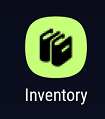

# Inventory2
Android Studio project:  
Create an Inventory app using an SQLite Database - Grow with Google - Udacity Nanodegree Scholarship 2018

## Synopsis

Name:  Inventory

This is an Inventory application using an SQLite Database to store a list of items.  

 

 <kbd></kbd>

There are screens to Add Items and Edit Inventory.  Dummy data can be added to speed the process of adding items.

The database has the following fields:  _ID, Product Name, Price, Quantity, Supplier Name, Supplier Phone Numer

 

 <kbd></kbd>

## Code Description

After the initial splash screen, which has an image of the db table columns, user can either add a new item with the floating button or insert data.  Then, the data can be edited.  There are two Activites:  CatalogActivity and EditoryActivity along with an InventoryCursorAdapter.

The CatalogActivity is for the main splash screen.  The EditorActivity is for editing the new and existing products in the inventory.  The InventoryCursorAdapter is used to pull the list together from the database.  

A delete quantity by 1 sale button on the list screen and delete (-) / add (+) buttons on the edit screen permit the user to adjust the quantity of items in the inventory. An item can be deleted from the inventory in the edit screen using a floating button.

Below are 4 screenshots with the splash screen, insertion of data, editing a product and adding a product displaying.

&nbsp;&nbsp;&nbsp;&nbsp;
&nbsp;&nbsp;&nbsp;&nbsp; 
&nbsp;&nbsp;&nbsp;&nbsp;
&nbsp;&nbsp;&nbsp;&nbsp;

## Motivation

Application was assigned as the final project for the "Grow with Google - Udacity Nanodegree Android Basics" program September, 2018.

## Installation

Project can be downloaded from GitHub.  
https://github.com/hillc255/Inventory2

## API Reference

## Tests (Future consideration!)

Describe and show how to run the tests with code examples.

## Contributors

Claudia Hill designed and developed this project.

## License

Only to be used for educational purposes
